# CyFun Single Pane of Glass

Self-hosted web application for one purpose: obtain and keep a **CyberFundamentals (CyFun) 2025** label from the Centre for Cybersecurity Belgium (CCB), at the **BASIC**, **IMPORTANT** or **ESSENTIAL** assurance level. It runs the CCB risk assessment that selects the level, the self-assessment with the exact CCB scoring of that level, the evidence and document registers, remediation tracking, read-only connectors to live systems, optional scoring proposals by Claude, and the exports needed for the self-declaration and the verification by a Conformity Assessment Body (CAB).

Two containers (application and TLS proxy), one SQLite file, Microsoft Entra ID single sign-on or local accounts. Server settings live in environment variables; connector credentials, the backup schedule and the Anthropic API key are entered on a Settings page and stored encrypted. The document register can follow a Notion database, and the whole application (data, files and settings) is backed up as one encrypted file, optionally copied to OneDrive.

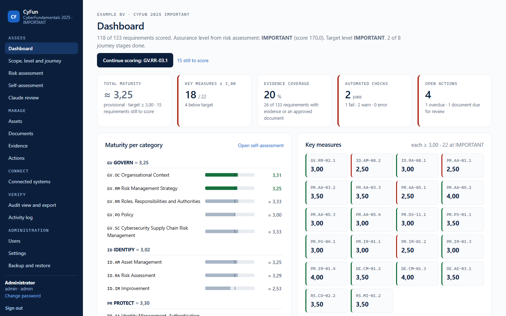

## What it does

| Module | Purpose | CyFun hook |
|---|---|---|
| Scope, level and journey | Organisation, legal entity, scope statement, CAB, self-assessment date, target assurance level; eight journey stages from scope to label | CAS self-declaration |
| Risk assessment | CCB "CyFun-Selection" method: 5 attack categories × 5 threat actors, sector defaults for all 16 NIS2 sector sheets, organisation size, score and resulting level | assurance level selection, ID.RA-05.1 |
| Risk register | Threats, vulnerabilities, likelihood × impact, treatment, owner, review date | ID.RA-01.1, ID.RA-05.1 |
| Self-assessment | Requirements of the chosen level (34 / 133 / 218), key measures (13 / 22 / 29), controls linked to management aspects; documentation and implementation maturity 1 to 5; N/A rules per level; justification per requirement; CCB goal statement and guidance per requirement | the CCB self-assessment tools, scoring reproduced formula by formula |
| Assets | Hardware, software, services, data, network, cloud, identities; classification, criticality, primary/secondary, owner; connector-synced items retire automatically | ID.AM-01.1, ID.AM-02.1, ID.AM-05.1, ID.AM-07.1 |
| Documents | Policies, procedures, plans, records with version, approval, review dates and requirement mapping; maintained in the application or synced from a Notion database | GV.PO-01.1, documentation maturity |
| Evidence | Files (SHA-256 hashed, random storage names), links, and automated evidence from every connector check (snapshot hash), mapped to requirements | verification |
| Actions | Remediation with owner, priority, due date, status | internal planning, excluded from exports |
| Connected systems | Microsoft 365 / Entra ID, GitHub, Railway, Cloudflare, Notion (document register). Each run refreshes the inventory or the document register, produces checks mapped to requirements and stores a raw snapshot | ID.AM, PR.AA, PR.PS, PR.IR, DE.CM, DE.AE, GV.PO |
| Claude review (optional) | Claude proposes documentation and implementation scores with a justification per requirement, or for a whole level in one batch, from the linked documents, evidence and checks. Guard rules apply the CCB definitions; an administrator accepts, edits or rejects every proposal; personal data is replaced by placeholders before sending | maturity scoring |
| Settings | Connector credentials, connector schedule, scheduled backup and OneDrive copy, Anthropic API key, model and monthly spend limit; secrets encrypted, never shown again | administration |
| Backup and restore | One encrypted file with all data, files and settings; download, restore with a pre-restore copy, scheduled backups with retention, OneDrive copy | operations |
| Audit view and export | Read-only verification view per requirement; snapshots; fills the official CCB workbook of the chosen level; audit pack ZIP; JSON | self-declaration and CAB verification |
| Users | Entra ID accounts with app roles, optional local accounts (admin and read-only auditor) | access control |
| Activity log | Append-only record of every change | traceability |

### Documents in Notion

Keep the policies, procedures, plans, registers and records in a Notion database and let the register follow it. Each page becomes a register entry with type, status, owner, version, approval and review dates, the requirements it supports and a link back to Notion; those entries are edited in Notion and are read-only in the application. The Settings page can create the database with the right properties. Checks report missing approvals, overdue reviews and documents without a requirement (GV.PO-01.1). Set-up: [docs/connectors.md](docs/connectors.md#notion).

### Backup and restore

The Backup and restore page downloads the whole application as one `.cyfunbak` file: the database (assessment, registers, users, activity log, Settings page values) and the evidence files and connector snapshots. The file is encrypted with AES-256-GCM under a key derived from `CYFUN_SECRET_KEY`; the page shows that key's fingerprint so you can check the copy in your password manager. A restore checks the whole file first and saves the current state as a pre-restore backup. On the Settings page, set an interval for scheduled backups on the server and, optionally, a OneDrive for Business folder for an off-host copy. Details and permissions: [docs/backup.md](docs/backup.md).

Scores stay a human judgement. Connector checks are evidence placed next to the requirement, not an automatic score, and a proposal by Claude changes nothing until an administrator accepts it. Accepted proposals are marked as such in the audit view and the audit pack.

## Assurance levels, as the CCB tools define them

| | BASIC | IMPORTANT | ESSENTIAL |
|---|---|---|---|
| Requirements | 34 | 133 (34 Basic + 99 Important) | 218 (+ 85 Essential) |
| Key measures | 13 | 22 | 29 |
| Each key measure | ≥ 2,5 | ≥ 3 | ≥ 3 |
| Each category | no threshold | no threshold | ≥ 3 |
| Total maturity | ≥ 2,5 | ≥ 3 | ≥ 3,5 |
| Not applicable | max 1, counts 2,5 | max 3, counts 3 | max 5, counts 3; never on key measures or management-aspect controls |
| CCB tool version | 2026-02-20 | 2026-02-20 | 2026-02-25 (v3.1) |

Subcategory score = average of its requirements. Category score = average of its subcategories. Category maturity = average of documentation and implementation. Total maturity = average of the category maturities. Scores are stored per requirement, so changing the target level keeps what was entered.

The tests reproduce the CCB workbooks' category and key-measure results for all three levels and the totals and levels of all 16 CCB risk sector sheets. Note: the CCB IMPORTANT and ESSENTIAL workbooks list only the 13 BASIC key measures in their summary tables; this application evaluates every requirement the workbook flags as a key measure (22 and 29), which matches the CCB key measures document.

## Screenshots

| Self-assessment | Requirement detail |
|---|---|
| 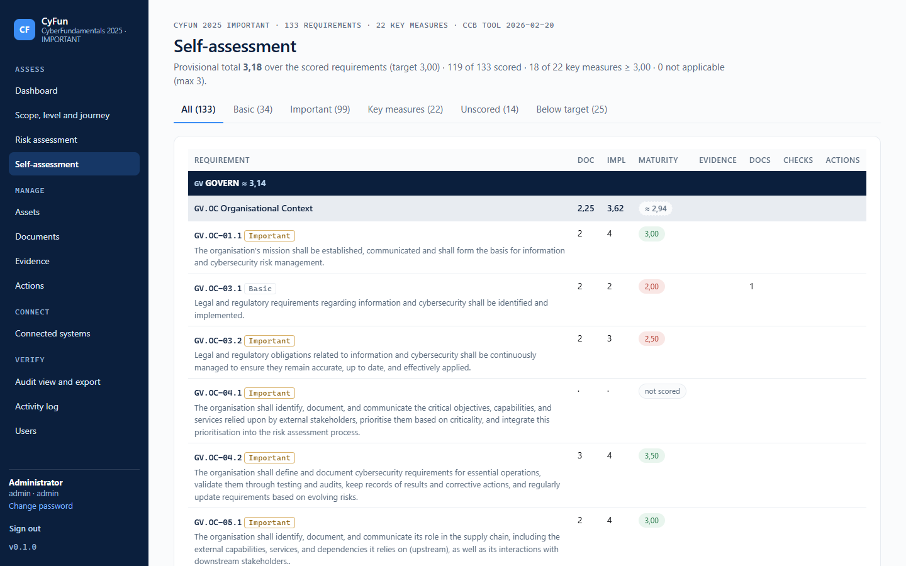 | 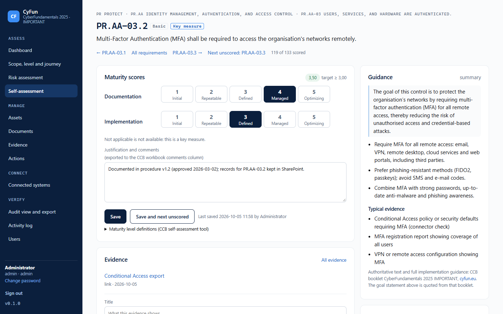 |

| Risk assessment | Audit view |
|---|---|
| 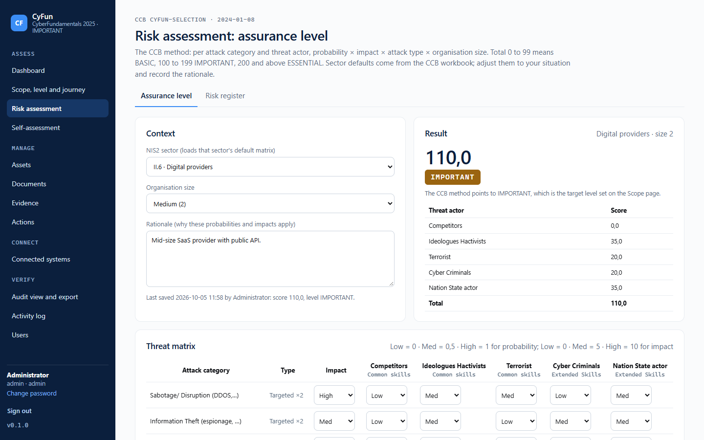 | 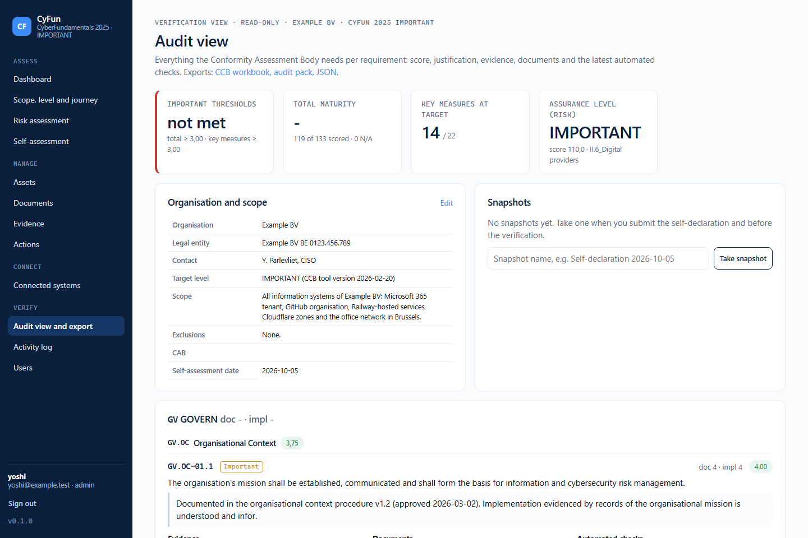 |

| Scope and level | Document register |
|---|---|
| 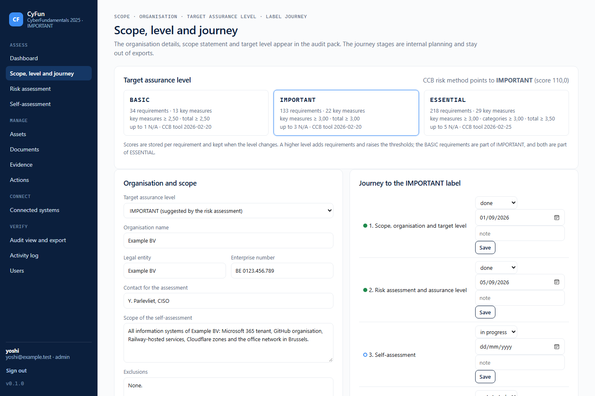 | 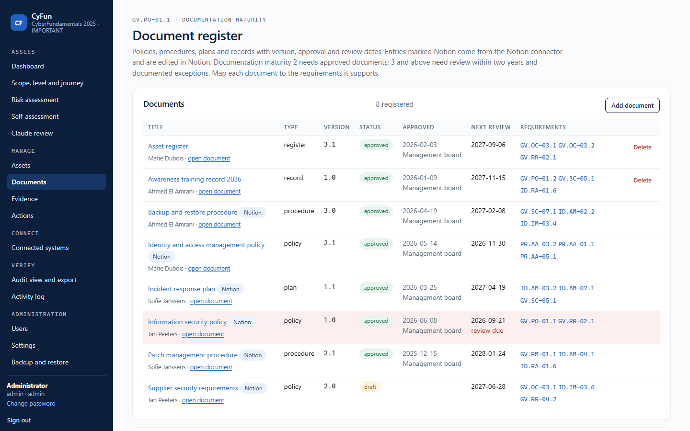 |

| Claude review of a requirement | Proposals and batch review |
|---|---|
|  | 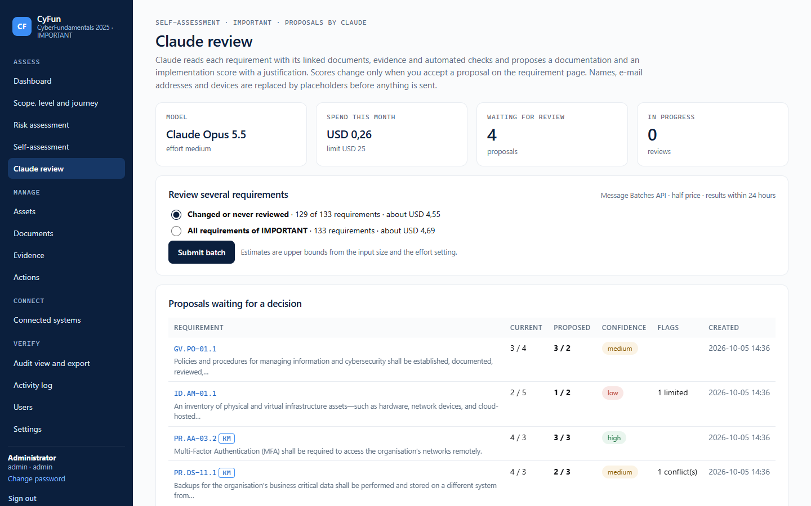 |

| Connected systems | Settings |
|---|---|
| 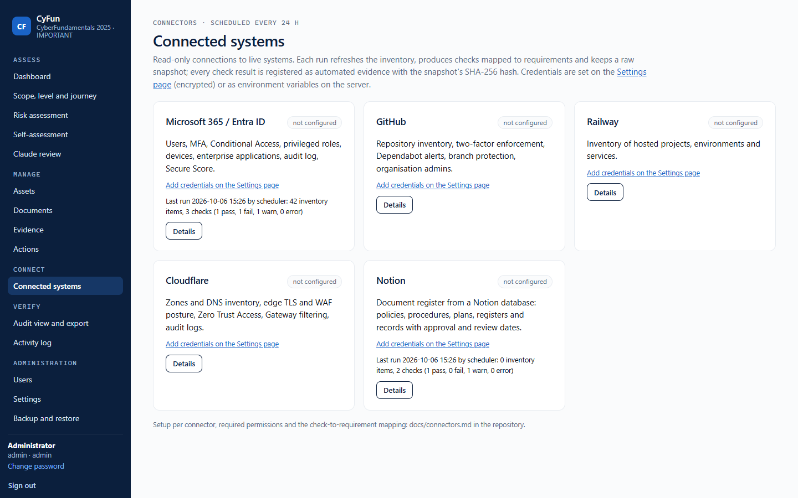 | 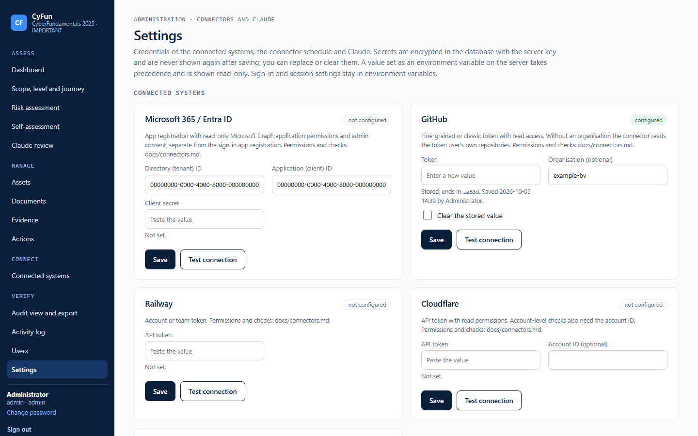 |

| Backup and restore | Users |
|---|---|
| 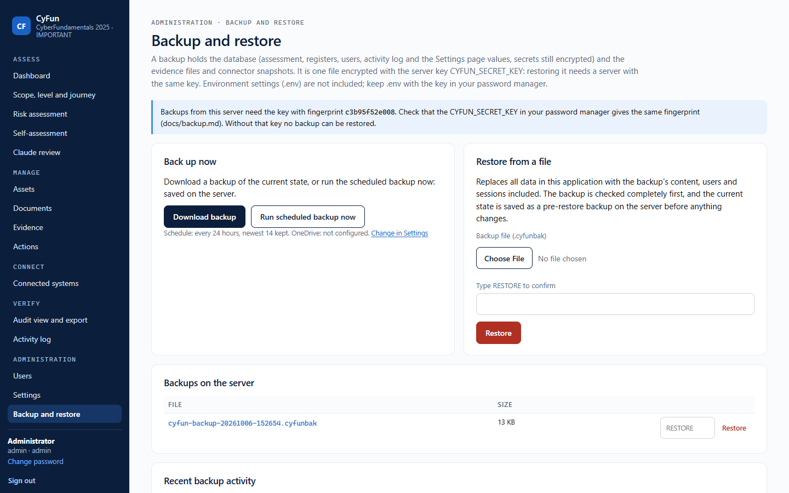 | 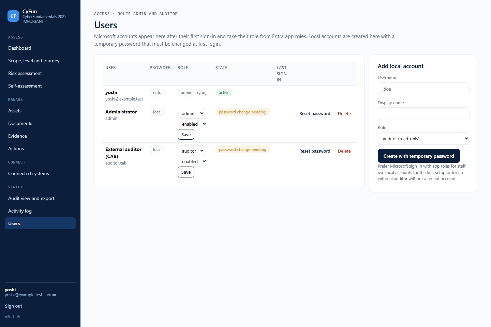 |

All screenshots show sample data.

On a phone the navigation folds into a menu and every page fits the screen without sideways scrolling. Register tables become stacked rows, the scoring page shows the guidance first and keeps the Save buttons in view, and the meaning of the chosen maturity level is spelled out under the buttons. Checked with axe-core at 320, 390, 768 and 1440 px.

| Phone: dashboard | Phone: scoring a requirement | Phone: document register | Phone: menu |
|---|---|---|---|
| 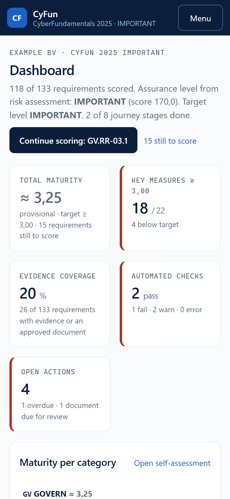 | 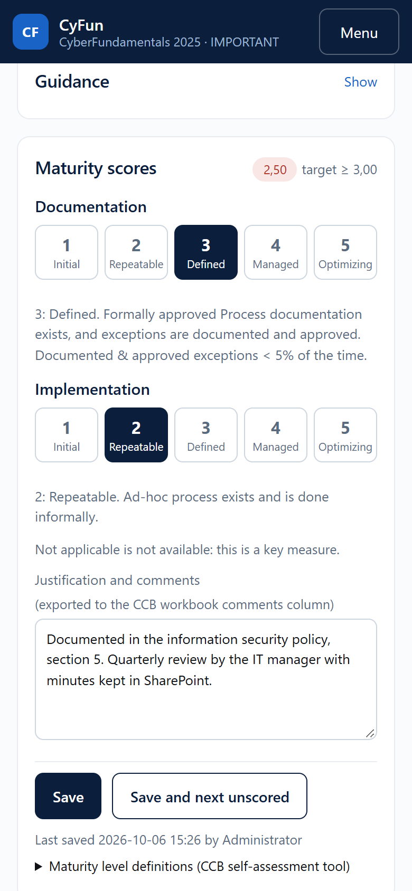 | 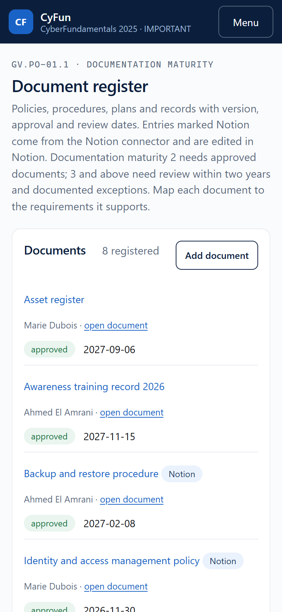 | 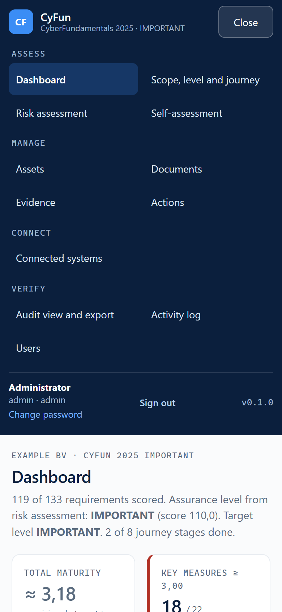 |

## Quick start

Local, in five minutes, with a local account:

```bash
git clone https://github.com/yopazerbot/cyfun-basic-singlepaneofglass.git
cd cyfun-basic-singlepaneofglass
python -m venv .venv && . .venv/bin/activate        # Windows: .venv\Scripts\activate
pip install -r requirements.txt
cp .env.example .env                                 # defaults are fine for localhost
python -c "import secrets; print(secrets.token_urlsafe(32))"   # paste as CYFUN_SECRET_KEY in .env
PYTHONPATH=app uvicorn cyfun.main:app --reload       # Windows: scripts\run-dev.ps1
```

Open http://localhost:8000 and sign in with `admin` / `admin`. The application forces a new password before anything else. Set `APP_BASE_URL=http://localhost:8000` in `.env` for local use (cookies are marked Secure only on https). Connector credentials, the Notion integration, the backup schedule and the Anthropic API key go on the Settings page.

Production, two containers behind Caddy with TLS:

```bash
cp .env.example .env            # APP_BASE_URL, APP_HOSTNAME, CYFUN_SECRET_KEY, optionally AUTH_*
docker compose up -d --build
```

On an Ubuntu server or VM, one command installs Docker, the application, a nightly backup and the `cyfun-update` command:

```bash
curl -fsSL https://raw.githubusercontent.com/yopazerbot/cyfun-basic-singlepaneofglass/main/deploy/install.sh | sudo bash
```

See [docs/deployment-proxmox.md](docs/deployment-proxmox.md) for the VM, the certificate and the steps after the install, and [docs/deployment-manual.md](docs/deployment-manual.md) for every step by hand. After the first sign-in, set a backup interval on the Settings page and keep `.env` (with `CYFUN_SECRET_KEY`) in your password manager: without that key no backup can be restored. Caddy serves `https://$APP_HOSTNAME` with an internal CA by default (set `CADDY_TLS` to an e-mail address for Let's Encrypt). Configure Entra ID sign-in when ready (docs/entra-id-sso.md) and set `AUTH_LOCAL_ENABLED=false` once it works, or keep local accounts for an external auditor.

## Documentation

| Document | Content |
|---|---|
| [docs/functionality.md](docs/functionality.md) | Functionality derived from the CyFun 2025 framework and the CAS |
| [docs/architecture.md](docs/architecture.md) | Components, data model, data flow, decisions |
| [docs/security.md](docs/security.md) | Threat model, controls, hardening checklist |
| [docs/entra-id-sso.md](docs/entra-id-sso.md) | Entra ID app registration, app roles, environment variables |
| [docs/connectors.md](docs/connectors.md) | Per connector: credentials, permissions, checks and their requirement mapping |
| [docs/backup.md](docs/backup.md) | Backup and restore of all data and settings, scheduled backups, OneDrive copy |
| [docs/ai-assistance.md](docs/ai-assistance.md) | Claude-assisted scoring: setup, what is sent, placeholders, guard rules, cost, accountability |
| [docs/deployment-proxmox.md](docs/deployment-proxmox.md) | Quick install in an Ubuntu VM with one command: certificate, host name, backups, Microsoft sign-in, updates |
| [docs/deployment-manual.md](docs/deployment-manual.md) | Every step by hand on Proxmox: VM, Docker, firewall, DNS and TLS, first sign-in, Entra ID, backup and restore, updates |
| [docs/audit-verification.md](docs/audit-verification.md) | Using the tool for the self-declaration and during the CAB verification |

## Repository layout

```
app/cyfun/                 application package (FastAPI, Jinja2, SQLAlchemy, SQLite)
  framework/               basic/important/essential_2025.json, risk_model.json, goals_2025.json (generated), guidance_basic_2025.json
  connectors/              microsoft, github, railway, cloudflare, notion (document register)
  ai/                      Claude review: requirement packet, placeholders, prompt, guard rules, API calls, workflow
  routers/                 one module per screen
  templates/ static/       server-rendered HTML, one stylesheet, vendored htmx
  auth.py passwords.py     Entra ID OIDC, local accounts (scrypt), sessions, user administration
  appsettings.py secretbox.py  Settings page values, AES-256-GCM encryption of stored secrets
  export_xlsx.py           fills the official CCB workbooks at XML level
  audit_pack.py            builds the audit ZIP
  backup.py onedrive.py    encrypted backup and restore, OneDrive copy
scripts/                   regenerate the framework JSON from the CCB workbooks and booklets; dev runner
tests/                     pytest suite (scoring, levels, risk model, export, connectors, Notion, backup, Claude review, sign-in, HTTP)
deploy/Caddyfile           TLS reverse proxy
deploy/install.sh          one-command install and update on Ubuntu or Debian
Dockerfile, compose.yaml   containers
```

## Framework content and licence

Requirement identifiers and statements come from the CCB self-assessment tools (BASIC and IMPORTANT tool version 2026-02-20, ESSENTIAL v3.1, requirements version 2025-10-01); the goal statement shown per requirement is quoted from the CCB booklets. Both are reproduced for non-commercial use with acknowledgement, as the CCB allows. The CCB workbooks and booklets themselves are not in this repository: regenerate the JSON with the scripts in `scripts/` from your own downloads, and upload your own copy of the workbook when exporting. See [NOTICE](NOTICE).

Code: MIT licence. CyFun is a trademark of the CCB; this project is independent of the CCB and of any CAB.
