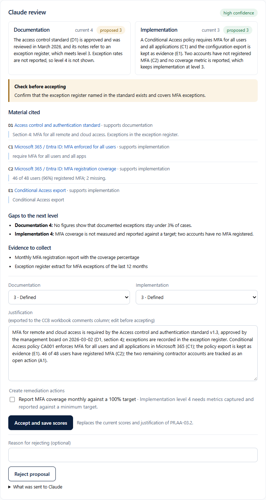

# Claude-assisted scoring

Claude (Anthropic API) reads one requirement together with the material the application holds for it and proposes a documentation score, an implementation score and a justification for the CCB workbook. A proposal changes nothing. An administrator accepts it, edits it before accepting, or rejects it. The self-assessment stays the organisation's declaration, and the activity log, the audit view and the audit pack record which scores came from a proposal and who accepted them.

## Setup

1. Create an API key in the Claude Console. A separate workspace with its own spend limit keeps this use apart from other work.
2. Settings, section Claude: paste the key, choose the model and the reasoning effort, set the monthly spend limit, then "Test connection". The test reads the model's details and costs nothing.
3. Allow outbound HTTPS from the application container to `api.anthropic.com` (port 443).

The key is stored encrypted like the connector credentials (see docs/security.md). `ANTHROPIC_API_KEY`, `AI_MODEL`, `AI_EFFORT`, `AI_MONTHLY_CAP_USD` and `AI_REVIEW_AFTER_SYNC` in `.env` override the page.

| Setting | Default | Notes |
|---|---|---|
| Model | Claude Opus 5.5 | Claude Sonnet 5.5 costs half per token. |
| Reasoning effort | Medium | High reasons longer and costs more per review; low is cheaper and shallower. |
| Monthly spend limit | USD 25 | No review starts once the estimated spend of the calendar month would pass it. 0 stops all reviews. |
| Review after each scheduled connector run | off | Submits a batch for the requirements whose material changed since their last review. |

## Reviewing one requirement

On a requirement page, "Ask Claude for a proposal". The review runs in the background and the panel updates itself, usually within a minute. The panel shows:

* current and proposed scores per dimension, with Claude's reasoning
* limits applied by the guard rules, with the reason
* the material Claude cited, each with a quote that was checked against the source
* gaps to the next level, evidence to collect and proposed remediation actions
* conflicts with the current score or justification, and points to verify before accepting
* exactly what was sent, the model, the prompt version, the input hash, token counts and the cost

Accepting writes both scores and the justification (edited or not) to the requirement, clears a not-applicable mark, and creates the remediation actions you tick. Saving the score form by hand afterwards makes the scores a manual decision again.

## Reviewing several requirements

Claude review page: submit a batch for the requirements whose material changed since their last review (or were never reviewed), or for every requirement of the level. Batches use the Message Batches API at half the price; results arrive within 24 hours, usually within an hour, and are collected every 5 minutes. One batch runs at a time. Results land in the list "Proposals waiting for a decision".

"Changed" compares a hash of the material: linked documents, the titles of the other register documents, linked evidence, the latest checks (status and summary), open actions, and for ID.RA and ID.AM requirements the risk register and inventory counts. The current score is not part of it, so accepting a proposal does not trigger a new review.

## What is sent

| Material | Sent |
|---|---|
| Requirement statement, level, key measure flag, CCB goal and guidance, thresholds of the level | yes |
| Current score and justification | yes |
| Documents linked to the requirement | title, type, status, version, owner, approver, dates, storage host name, notes |
| Other documents in the register | title, type, status, last review (to find an exception procedure, for example) |
| Evidence linked to the requirement | title, kind, description, date, collector, file name and size |
| Content of an evidence file | only when the file is marked "Claude may read this file" on the Evidence page: PDF up to 10 MB, images up to 5 MB, text files up to 100 KB, at most 20 MB per review |
| Latest automated checks mapped to the requirement | connector, check, status, summary, details (lists longer than 25 entries are shortened and say so) |
| Open remediation actions of the requirement | title, status, owner, due date |
| Risk register (ID.RA and GV.RM requirements) | up to 40 entries |
| Asset inventory (ID.AM requirements) | counts only |
| Users, sessions, passwords, connector credentials, the activity log, the asset list itself, material of other requirements | no |

### Placeholders for personal data

Before sending, the application replaces e-mail addresses and user principal names (EMAIL-01), names of people it knows (PERSON-01: users, document owners and approvers, evidence collectors, action and risk owners, display names of synced identities), device names from the inventory (DEVICE-01), and every entry in the account lists of connector results, such as administrators, guests and accounts without MFA. The mapping stays in the local database; Claude's answer is translated back before anyone reads it. Names count as names of people when they consist of two to five capitalised words without role words such as "manager" or "team".

Limits: text inside PDFs and images is sent as it is; a name the application does not know is not detected; organisation names and domain names are kept.

## Guard rules

Claude's answer is checked before it is shown:

1. The answer must match the JSON schema (scores 1 to 5).
2. Every cited item must exist in the material, and every quote must appear in that item. Unknown references and quotes that are not found are removed, and the panel says so.
3. The CCB maturity definitions are applied strictly where the material allows a mechanical check:
   * documentation 2 or higher needs an approved document linked to the requirement;
   * documentation 3 or higher needs one reviewed or approved within the previous 2 years;
   * implementation 3 or higher needs at least one evidence item or one passing check.

   A proposal above such a limit is lowered to it, and the reason is shown next to the score.
4. Text inside the material is treated as data. Claude has no tools and cannot change anything in the application.

## Accountability

* Activity log: review started, finished (proposed scores, model, cost), failed or declined, proposal rejected; an accepted proposal is logged as a score change with the proposal number, the model, the prompt version, the SHA-256 of the input and whether it was edited.
* Requirement page, audit view and audit pack summary: "Scores proposed by Claude (model) and accepted by name on date".
* `assessment.json` in the audit pack and the JSON export: `score_origin` per requirement.
* The CCB workbook export is unchanged: it carries the scores and the justification as accepted.
* Auditors (read-only role) do not see proposals or Claude review events; like remediation actions, they are working material.

## Cost

| Model | Input | Output | Cache read |
|---|---|---|---|
| Claude Opus 5.5 | USD 4 per million tokens | USD 20 per million tokens | USD 0,20 per million tokens |
| Claude Sonnet 5.5 | USD 2 per million tokens | USD 10 per million tokens | USD 0,20 per million tokens |

Batches cost half. The instructions and the CCB maturity definitions (about 1 400 tokens) are the same for every review and are cached. A requirement packet is typically 1 500 to 5 000 tokens; the answer including Claude's reasoning is roughly 1 500 to 6 000 output tokens depending on the effort. The panel shows the actual cost of each proposal; the spend limit uses an upper estimate before anything is sent. Measure a few reviews before submitting a batch for a whole level.

## Refusals and failures

Claude's safety classifiers can decline a request, which is rare for this material but possible for security-related content. Single reviews opt into server-side fallbacks: a declined request is re-run on the model Anthropic recommends for that case, and the proposal records which model answered. Batch requests cannot use fallbacks; a declined requirement shows "Claude declined" and is scored manually. Other failures (rate limit, timeout, malformed answer) show the reason and a "Try again" button. A restart during a review marks it as interrupted.

## Data handling

Requests go from the server to `api.anthropic.com` over HTTPS and are processed under the Anthropic terms that apply to your API key. Check retention and use of API data under your organisation's agreement before sending material, and decide per evidence file whether its content may be sent.

## Prompt

The instructions and the output schema are in `app/cyfun/ai/prompt.py`. Every proposal records `PROMPT_VERSION`, so a change of the prompt is visible in the history of each score.
